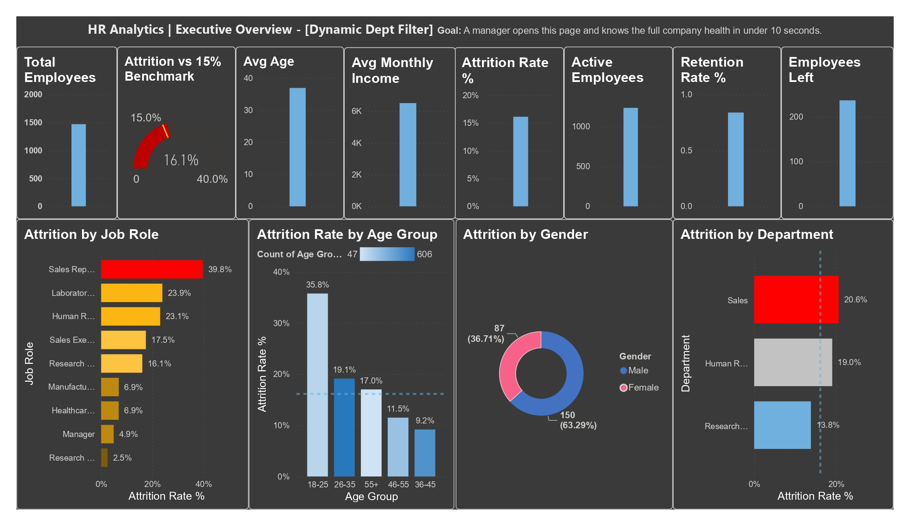
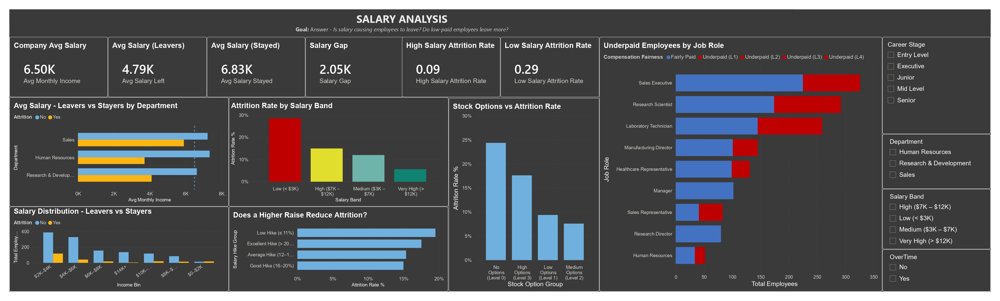
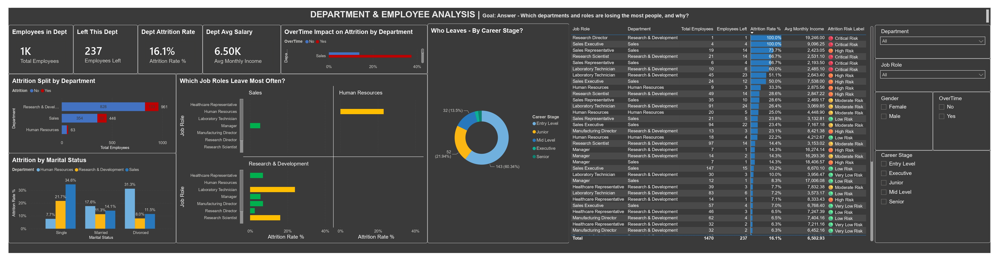
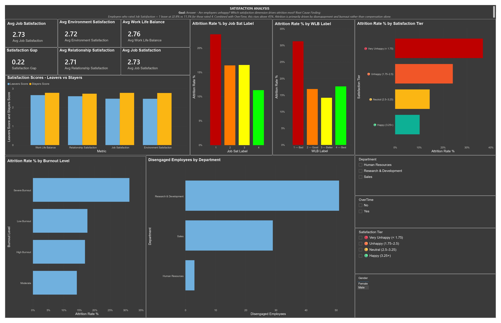

[Medium Artilce](https://medium.com/@ai.omar.rehan/i-built-an-hr-attrition-dashboard-in-power-bi-here-is-what-the-data-actually-told-me-02888ea3d5e5)

---

# HR Analytics Dashboard - Employee Attrition Analysis

A Power BI project built on the IBM HR Analytics dataset, focused on understanding why employees leave and giving management a clear picture of where the risks are.

The dataset has 1,470 employee records with 35 columns covering demographics, compensation, job details, satisfaction scores, and work history. The target variable is `Attrition` (Yes/No), which about 16% of employees fall into.

---

## Project Files

| File | What It Is |
|------|-----------|
| `Notes document.md` | Column-by-column breakdown of the entire dataset |
| `Power Query - Data Cleaning Guide.md` | Full M code and guide for cleaning the data in Power Query |
| `DAX Measures - HR Attrition Dashboard.md` | All 50 DAX measures used across the dashboard |
| `DAX Calculated Columns - Employee Groups.md` | 28 calculated columns for segmenting employees |
| `Dashboard Build - Page 1 Executive Overview.md` | Build guide covering all 4 dashboard pages (Steps 7-10) |

---

## Tools Used

**Power BI Desktop** was the main tool for building everything. The data was loaded directly from the CSV, cleaned in Power Query, then modeled with DAX.

**Tabular Editor 3** was used to extract the full data model including all measures, calculated columns, and table relationships in a structured way. It made it much easier to review and manage the DAX without navigating back and forth inside Power BI.

**DAX Studio** was used to run queries directly against the model and extract the underlying data, verify measure results, and check what was actually being calculated behind the visuals.

---

## What Was Built

### Step 1 - Understanding the Data

Before touching anything in Power BI, every column in the dataset was documented in the notes file. This covers what each column means, its data type, the value range, and which columns are useless constants that should be dropped (`EmployeeCount`, `Over18`, `StandardHours`).

### Step 2 - Data Cleaning in Power Query

The raw CSV goes through 15 transformation steps in Power Query before any visuals are built. The cleaning covers:

- Removing the three constant columns that add no value
- Fixing every column to its correct data type
- Removing duplicate rows based on Employee ID
- Filtering out rows with missing values in critical columns
- Renaming all columns to readable, spaced-out names
- Trimming whitespace from all text columns

Beyond the basics, it also adds several new columns during the cleaning step: `Attrition (Binary)` for rate calculations, `Age Group` for age-based analysis, `Education Level` converting the 1-5 numeric scale to readable text, `Job Level Label`, `Salary Band`, `Satisfaction Index`, and `Tenure Risk`.

### Step 3 - DAX Measures (50 Total)

All measures live in a dedicated `_Measures` table to keep them separated from the data columns. They are organized by dashboard page:

**Executive KPIs:** Total Employees, Active Employees, Employees Left, Attrition Rate %, Retention Rate %, Avg Monthly Income, Avg Age, Avg Tenure, Salary Gap between stayers and leavers.

**Employee Analysis:** Attrition rates filtered by department, job role, overtime status, marital status, travel frequency, and tenure window. High Risk employee count based on combined conditions.

**Salary Analysis:** Avg salary split by attrition status, salary ratio of leavers vs company average, attrition rates by salary tier, hike percentage comparison, stock option impact.

**Satisfaction Analysis:** Individual averages for all four satisfaction dimensions (job, environment, relationship, work-life balance), an overall Satisfaction Index, a Satisfaction Gap between stayers and leavers, and attrition rates filtered by each satisfaction score level.

**Cross-cutting:** Stagnation risk rate, a 0-6 point Attrition Risk Score per employee, entry-level attrition rate, and long-commute attrition rate.

### Step 4 - Employee Groups (28 Calculated Columns)

These are calculated columns added directly to the `HR_Attrition` table. They turn raw numbers into categories that can be used as chart axes, slicers, and filters.

Groups cover age buckets (including a generation label), salary tiers, salary hike categories, compensation fairness per job level, tenure stages, promotion stagnation flags, a loyalty score and loyalty group, satisfaction tiers for all four dimensions, an attrition risk score and risk label, overtime burnout risk, career stage labels, job hopper classification, training investment groups, stock option groups, commute distance bands, and manager relationship stages.

### Step 5 - Dashboard Pages

**Executive Overview (Page 1)**

Seven KPI cards across the top showing Total Employees, Active Employees, Employees Left, Attrition Rate, Retention Rate, Avg Monthly Salary, and Avg Age. Below that, four charts covering attrition by department, attrition by gender, attrition rate by age group, and attrition rate by job role. A gauge visual compares the current attrition rate against the 15% healthy benchmark.

**Department Analysis (Page 2)**

Focuses on which departments and roles are losing people. Uses a 100% stacked bar chart to show the leaver/stayer split per department, a job role attrition chart with conditional color coding, an overtime impact chart split by department, an attrition breakdown by marital status, a career stage donut, and a sortable table showing every department and role combination with its attrition rate and average salary.

**Salary Analysis (Page 3)**

Answers whether salary is driving attrition. Six KPI cards compare company average salary against what leavers and stayers earn. Charts include avg salary by department split by attrition, attrition rate by salary band (proving the inverse relationship), a salary distribution histogram showing where leavers cluster, hike percentage vs attrition, stock option level vs attrition, and a compensation fairness breakdown by job role.

**Satisfaction Analysis (Page 4)**

Covers the engagement and happiness side of attrition. Side-by-side comparison of all four satisfaction scores for leavers vs stayers. Individual charts for job satisfaction vs attrition, work-life balance vs attrition, overall satisfaction tier vs attrition, and burnout risk based on overtime combined with work-life balance score. Also shows disengaged employee counts by department.

---

## **My Dashboard**

---

## Key Findings

Based on the data and the measures built:

- Employees earning under $3,000/month leave at close to three times the company average rate.
- Employees working overtime leave at roughly double the rate of those who do not.
- Job satisfaction score of 1 corresponds to an attrition rate of around 22%, compared to 11% for score 4.
- New employees in their first 1-2 years are the highest-risk tenure group.
- Sales Representatives and Laboratory Technicians have the highest attrition rates by job role.
- Single employees leave more than married or divorced employees across all departments.

---

## Dataset

[IBM HR Analytics Employee Attrition dataset. 1,470 rows, 35 original columns. Publicly available on Kaggle.](https://www.kaggle.com/datasets/pavansubhasht/ibm-hr-analytics-attrition-dataset)
